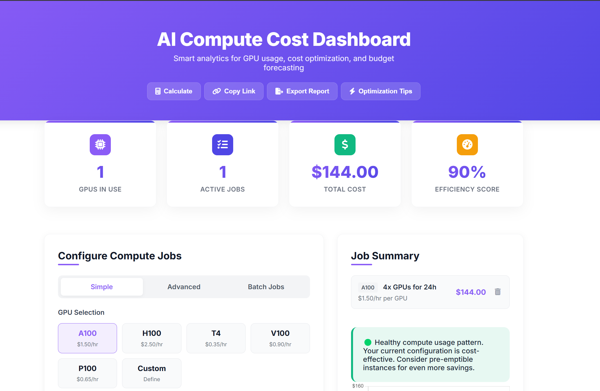

# One-File AI Compute Cost Dashboard


A powerful, standalone tool for calculating, visualizing, and optimizing AI/ML compute costs. This single HTML file dashboard provides enterprise-grade features with zero dependencies and no server requirements.

<p align="center">
  
</p>

## Features

### 📊 Comprehensive Cost Management
- Track expenses across multiple GPU types and training jobs
- Calculate total compute costs with precise hourly rates
- Support for all major GPU types (A100, H100, T4, V100, etc.)
- Create custom GPU definitions with your own pricing

### 🚀 Advanced Visualization
- Real-time cost breakdown charts by GPU type
- Interactive job management interface
- Efficiency score calculator for your compute strategy
- Visual indicators of cost-saving opportunities

### 💡 AI-Powered Optimization
- Smart recommendations based on your compute patterns
- Detailed optimization reports with quantified savings
- Advanced cost-reduction techniques including:
  - Spot/preemptible instance recommendations
  - GPU right-sizing analysis
  - Mixed precision training opportunities
  - Resource scheduling optimization
  - Storage cost reduction strategies

### 🛠️ Professional Tools
- Batch job processing with CSV/JSON import
- Shareable configuration via URL parameters
- Exportable reports in Markdown format
- Dark/light theme toggle with persistent settings

## Getting Started

### Quick Start

1. Download the `index.html` file
2. Open it in any modern browser
3. Start adding your AI compute jobs

No installation required! The dashboard runs entirely in your browser with no external dependencies or server requirements.

### Usage Examples

#### Basic Job Creation
1. Select your GPU type (A100, H100, etc.)
2. Enter training duration in hours
3. Specify number of GPUs needed
4. Click "Add Training Job"

#### Advanced Configuration
- Use the "Advanced" tab for detailed job configuration
- Specify GPU memory requirements
- Adjust utilization factors for more accurate estimates
- Combine different GPU types for complex training workflows

#### Batch Processing
1. Prepare a CSV or JSON file with your jobs
2. Use the "Batch Jobs" tab
3. Drag and drop your file onto the import zone
4. Review and finalize the imported jobs

## CSV Format

Import jobs in bulk with this CSV format:

```csv
hours,gpus,gpu_type,rate
24,4,A100,1.5
48,8,H100,2.5
168,2,T4,0.35
```

## JSON Format

Alternatively, use JSON format:

```json
[
  {"hours": 24, "gpus": 4, "gpu_type": "A100", "rate": 1.5},
  {"hours": 48, "gpus": 8, "gpu_type": "H100", "rate": 2.5},
  {"hours": 168, "gpus": 2, "gpu_type": "T4", "rate": 0.35}
]
```

## Optimization Insights

The dashboard analyzes your compute usage and provides actionable insights:

- Spot instance potential savings
- GPU right-sizing recommendations
- Mixed precision training opportunities
- Resource scheduling optimization
- Storage cost reduction strategies

## Data Privacy

All data remains local in your browser. The dashboard:
- Uses localStorage for persistence between sessions
- Does not send any data to external servers
- Keeps your compute cost information completely private

## Browser Compatibility

- Chrome 80+
- Firefox 75+
- Safari 13.1+
- Edge 80+

## Development

### Technologies Used
- Vanilla JavaScript
- Chart.js for data visualization
- PapaParse for CSV processing
- HTML5 and CSS3 with modern features
- LocalStorage for client-side persistence

### Customization
The dashboard is designed to be easily customizable:
- Modify GPU rates in the script section
- Add new visualization types by extending the Chart.js implementation
- Customize the CSS variables for complete visual redesign

## License

MIT License - feel free to use, modify, and distribute as needed.

## Acknowledgments

- Built with Chart.js for responsive data visualization
- CSV parsing powered by PapaParse
- Icons provided by Font Awesome

---

<p align="center">
  Built with ❤️ for the AI/ML community
</p>
